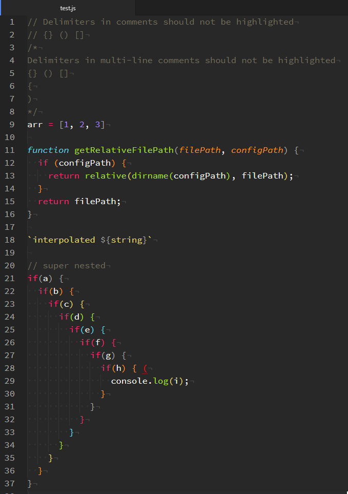
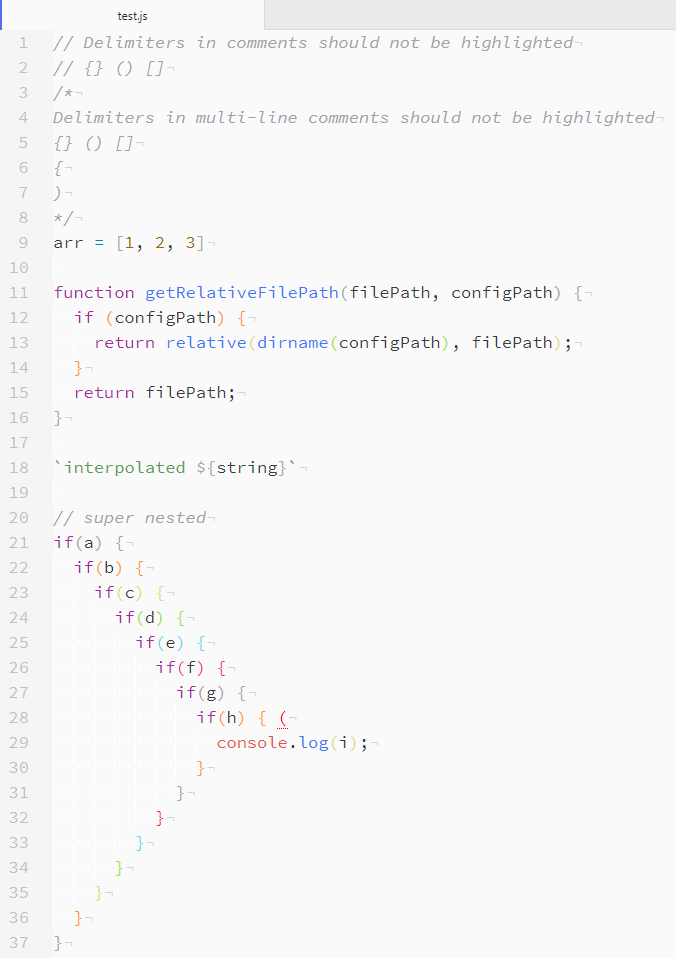
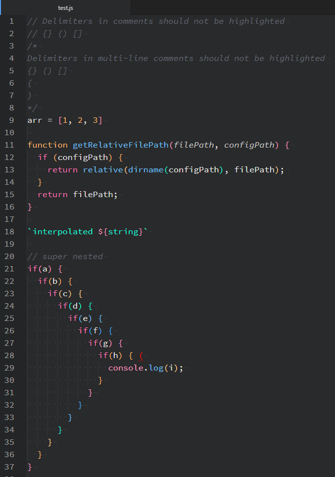
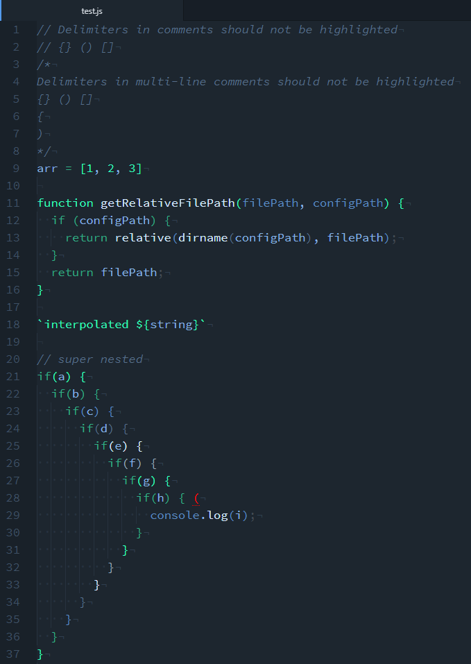

# Prismatic Parentheses (and brackets and braces)

## Description
This is my rainbow delimiter package. It will automatically detect and highlight your parentheses, brackets, and braces according to your current syntax theme. Unmatched delimiters are underlined and highlighted red.

## Install
You can install this in the atom settings menu by searching for prismatic parens, or using `apm` at your terminal with `apm install prismatic-parens`

## Roadmap
Lots more to come, including custom themes and support for delimiters other than brackets, braces, and parentheses (like ruby's `class..end`). I'd like to improve performance at some point by using a better marker invalidation strategy.

## Screenshots
Above you can see this applied with the Monokai theme. Here's a few more, including a light theme (light themes don't typically get great contrast between colors, so your mileage may vary).

### One Light

### Atom Panda

### Duotone Dark Sea

