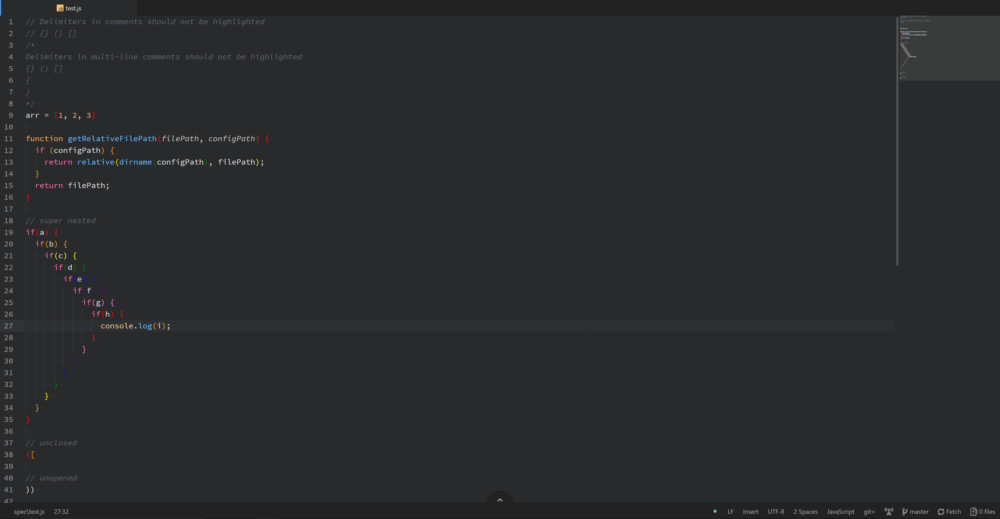

# Skittles
Taste the rainbow!

This is my rainbow delimiter package. `Skittles: Toggle` turns it on.

Lots more to come, including custom themes and support for delimiters other than brackets, braces, and parentheses.
