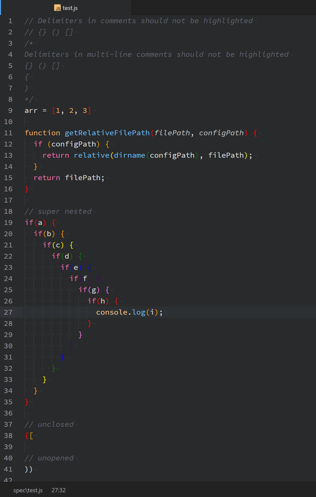

# Prismatic Parentheses (and brackets and braces)
BETA BETA BETA - Still massively unperformant, since it re-highlights everything on any change.

## Description
This is my rainbow delimiter package. `Prismatic Parens: Toggle` turns it on.

If you want to have it always turned on, put `prismatic-parens:toggle` in your init.coffee

## Roadmap
Lots more to come, including custom themes and support for delimiters other than brackets, braces, and parentheses.
